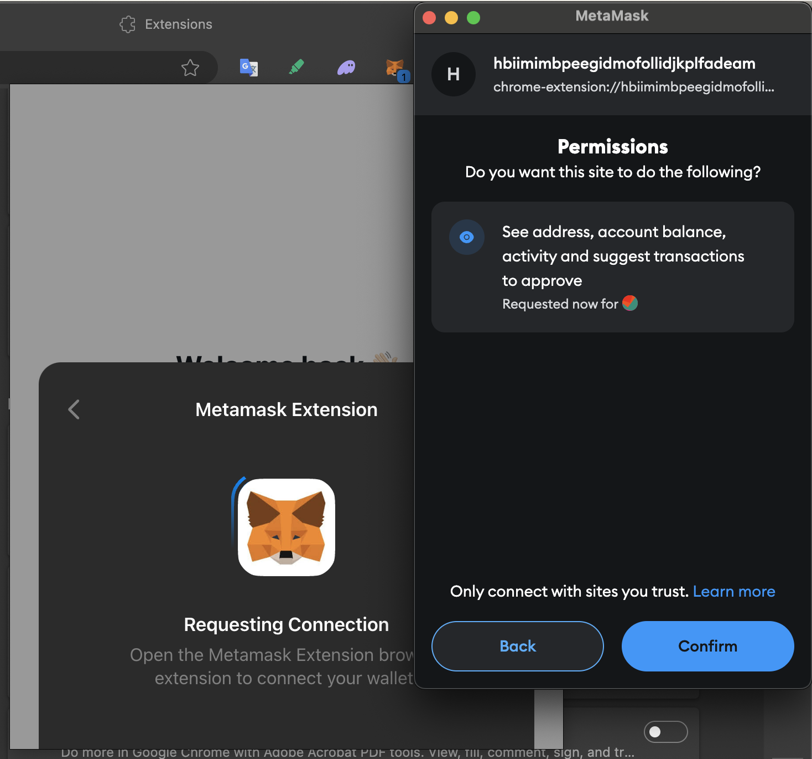
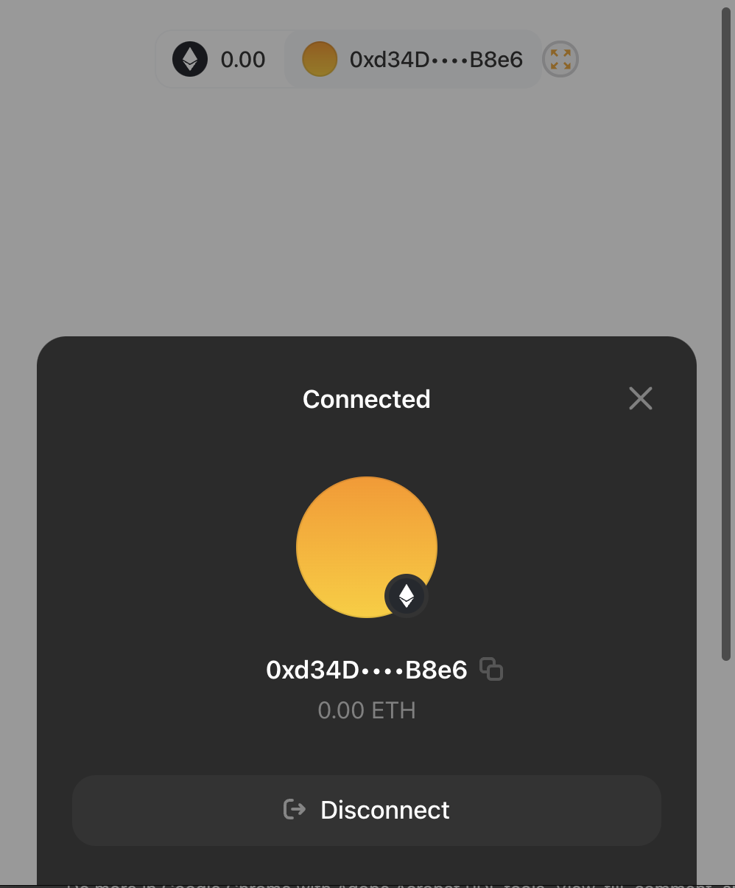

# Extension-as-a-Dapp: a boilerplate of connecting browser extensions to browser-based Metamask via PortStream

## How to test with Edge & Chrome
- Clone .example.env to .env and change VITE_WALLET_CONNECT_PROJECT_ID
- `pnpm install`
- `pnpm dev`
- Load the `dist` folder to browser as an unpacked package to test

## Reference 

- [JongHak Seo/Chrome Extension Boilerplate with React + Vite + Typescript](https://github.com/Jonghakseo/chrome-extension-boilerplate-react-vite)
- [Metamask extension-provider](https://github.com/MetaMask/extension-provider)

## Star History 

<a href="https://star-history.com/#galin-chung-nguyen/extension-as-a-dapp&Date">
 <picture>
   <source media="(prefers-color-scheme: dark)" srcset="https://api.star-history.com/svg?repos=galin-chung-nguyen/extension-as-a-dapp&type=Date&theme=dark" />
   <source media="(prefers-color-scheme: light)" srcset="https://api.star-history.com/svg?repos=galin-chung-nguyen/extension-as-a-dapp&type=Date" />
   
 </picture>
</a>
